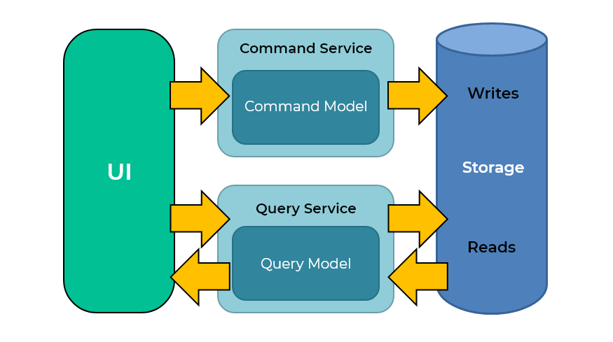
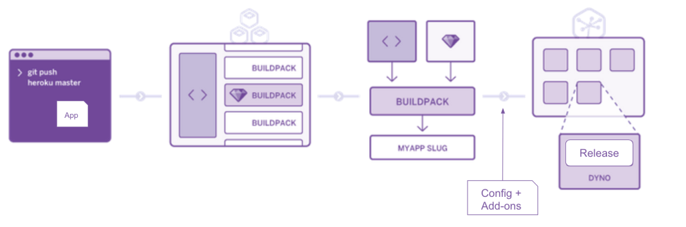
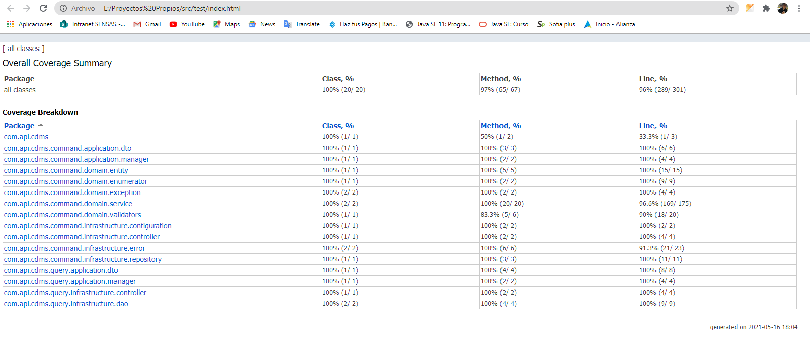

# Mutant Api

Esta API se utiliza para verificar si un ADN enviado pertenece a un mutante o no, adicional a esto podemos consultar las estadísticas de los ADN analizados en la aplicación. 

# Construcción de la aplicación:

## 1. Tecnologías utilizadas:

- Java 11.
- Spring Boot.
- Base de datos: MySql.
- Gestor de dependecias: Gradle.

## 2. Arquitectura:

Se utilizo la arquitectura hexagonal con el fin de separar la aplicación en distintas capas con su propia responsabilidad y de esta manera desacoplar el core del negocio (dominio) de factores o dependencias externas.

## 3. Patrones:

- Se utilizo el patrón de diseño CQRS para separar las operaciones de lectura y escritura en la aplicación.

## 4. Principios:

- Se implementaron la mayoria de principios SOLID en la aplicación, con el fin de tener un aplicativo escalable y mantenible en el tiempo.

## 5. Despliegue en la Nube:

- Para el despluegue de la aplicación se utilizó Heroku, la cual es una plataforma como servicio de computación en la Nube.

## 6. Test de la aplicación:

### 6.1. Test Unitarios:

- Para los test unitarios se utilizó JUnit5 y Mockito.

### 6.2. Test Integración:

- Para los test de integración se utilizo JUnit5, MockMVC y base de datos H2 embebida.

**Para ejecutar los test de la aplicación, se debe correr el comando:** `gradlew test`

## 7. Cobertura:

- Se tuvo una cobertura total de: Class: 100%, Method: 98%(62/63), Line: 96% (289/301).

## 8. Documentación del API:

- Se utilizo Swagger para la documentación del API REST, en la siguiente URL se puede encontrar toda la información: https://mutant-api-meli.herokuapp.com/magneto/swagger-ui.html 

## 8. Ejemplos de como consumir los endpoints en la nube y en local:

### 8.1. Nube:

Para el consumo de los servicios en nube, se debe abrir un cliente que permita consumir el API (Ej: postman, insomnia, etc).

- Ejemplo para el consumo de verificación y guardado de ADN mutante

        Método: POST
        URL: https://mutant-api-meli.herokuapp.com/magneto/v1/mutant
        Body: {"dna": ["ATGCGA","CAGTGC","TTATGT","AGAAGG","CCCCTA","TCACTG"]}

### 8.2. Local:

Para el consumo de los servicios en local, lo primero que se debe hacer es configurar el usuario de la base de datos de MySQL, luego de esto se debe ejecutar el comando `gradlew clean bootRun` en la raíz del proyecto.

Luego de tener la aplicación corriendo, se debe abrir un cliente que permita consumir el API (Ej: postman, insomnia, etc).

- Ejemplo para el consumo de verificación y guardado de ADN mutante

        Método: POST
        URL: http://localhost:8082/magneto/v1/mutant
        Body: {"dna": ["ATGCGA","CAGTGC","TTATGT","AGAAGG","CCCCTA","TCACTG"]}
        
### Nota:
En la raíz del proyecto se encuentra una carpeta `docs/postman_collections` en la cual se podrá encontrar los diferentes consumos tanto para el ambiente local como para el de producción
con los diferentes escenarios y de esta manera poder probar de una manera más eficiente los casos de prueba que se pueden presentar.

